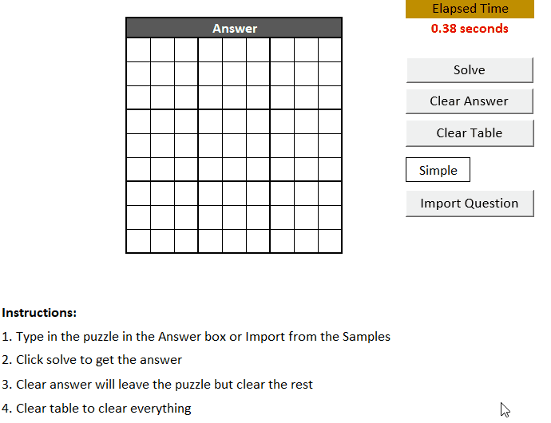
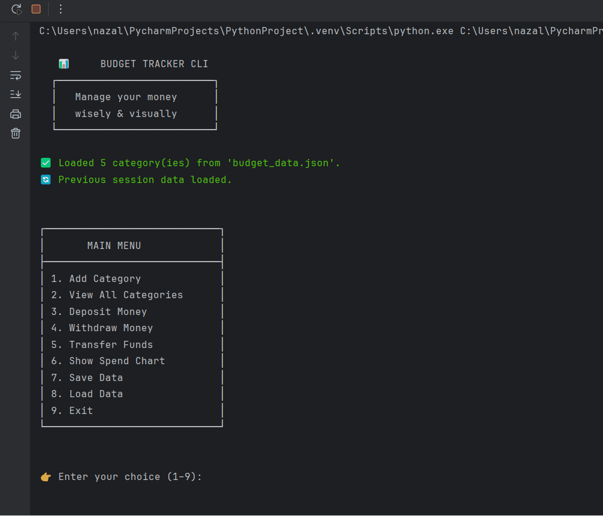

# My-Programming-Portfolio
Portfolio showcasing Excel with VB, Python, SQL and PL/SQL projects

## Skills:
- Excel: Sudoku solver - Puzzle solver wth human brain like logic instead of brute force - Excel with VB
- Python: Developed a Python-based budget calculator using object-oriented design, featuring category-level ledgers, fund transfers, and a terminal-rendered ASCII chart visualizing percentage spending with the ability to save data and load later.

## Projects
### Excel
- [Sudoku Solver] (Python/Excel/README.md) - 
- View Code → /Python/Budget_Calculator - 

### Python
- [Budget Calculator] (Python/Budget_Calc/README.md)
